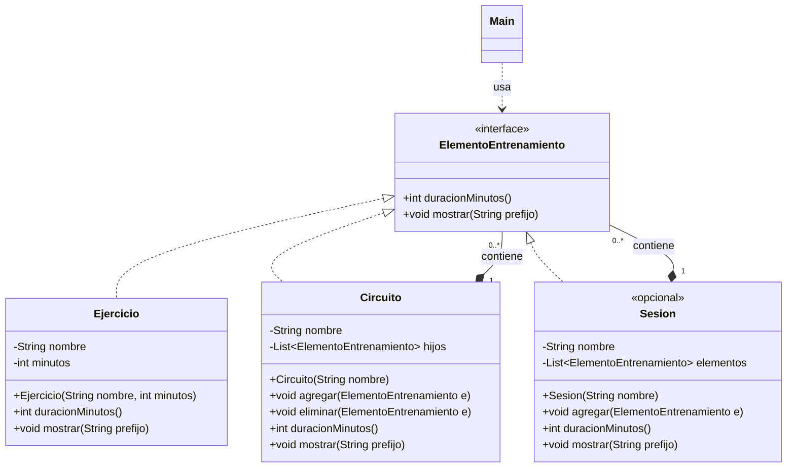

# 🧩 Lab 03 — Patrón **Composite** (Compuesto)

## 🌳 Enunciado

Vas a construir un **planificador de entrenamientos** para una app de gimnasio.

En la app, un entrenamiento real suele organizarse como un **árbol**:

- Una **sesión** puede contener ejercicios sueltos (por ejemplo, “Calentamiento 10 min”).
- También puede contener **circuitos**, y cada circuito contiene varios ejercicios.
- Incluso un circuito podría contener **subcircuitos** (por ejemplo, “Circuito A” con “Bloque 1” y “Bloque 2”).

El objetivo es que el código cliente pueda tratar **igual** a:

- un **ejercicio individual** (hoja) y
- un **grupo de ejercicios** (compuesto)

…usando una **interfaz común**, sin hacer `instanceof` ni preguntar “¿eres hoja o compuesto?”. ✅

### 🧩 Diagrama de clases (Mermaid)

> La clase `Sesion` es **opcional**: si prefieres, puedes usar un `Circuito` como raíz del árbol.



### 🎯 Qué debe poder hacer el sistema

1. Calcular la **duración total** (en minutos) de una sesión completa.
2. Mostrar por consola la **estructura jerárquica** del entrenamiento (con sangría).

---

## 🧠 Pistas (conexión con el ejemplo visto en clase)

En tus transparencias y en el ejemplo Java de `Composite`, el cliente trabaja contra una interfaz (por ejemplo, `Grafico`) y el compuesto delega recursivamente.

Aquí haremos lo mismo, pero con otra temática:

- **Component** → `ElementoEntrenamiento`
- **Leaf** → `Ejercicio`
- **Composite** → `Circuito` (y opcionalmente `Sesion`)
- **Client** → `Main` (código de pruebas)

---

## 🧱 Pasos para la implementación (sin “darlo todo hecho”)

> Recomendación: crea un paquete nuevo, por ejemplo `es.uva.poo.ejercicios.composite.entrenamiento`.

### 1) Define el componente común
Crea la interfaz `ElementoEntrenamiento` con operaciones mínimas para el cliente:

- `int duracionMinutos()` → devuelve la duración total del elemento.
- `void mostrar(String prefijo)` → imprime el elemento con un prefijo (para sangría).

Esqueleto orientativo:

```java
public interface ElementoEntrenamiento {
    int duracionMinutos();

    void mostrar(String prefijo);
}
```

### 2) Implementa la hoja: `Ejercicio`
Un `Ejercicio` es un elemento simple (no tiene hijos).

- Atributos sugeridos: `nombre` (String), `minutos` (int)
- `duracionMinutos()` devuelve sus minutos.
- `mostrar(prefijo)` imprime algo tipo: `prefijo + "- Ejercicio: ..."`

Deja controlado:
- que `minutos` no sea negativo
- que `nombre` no sea nulo/vacío

### 3) Implementa el compuesto: `Circuito`
Un `Circuito` contiene una lista de `ElementoEntrenamiento`.

Operaciones sugeridas:
- `void agregar(ElementoEntrenamiento e)`
- `void eliminar(ElementoEntrenamiento e)`

Y la parte importante (Composite):
- `duracionMinutos()` recorre hijos y **suma**.
- `mostrar(prefijo)` imprime el nombre del circuito y llama recursivamente a `mostrar` de cada hijo aumentando la sangría.

Esqueleto (rellena los TODO):

```java
public class Circuito implements ElementoEntrenamiento {
    // TODO atributos: nombre + lista de hijos

    public void agregar(ElementoEntrenamiento e) {
        // TODO validar y añadir
    }

    @Override
    public int duracionMinutos() {
        // TODO sumar recursivamente
        return 0;
    }

    @Override
    public void mostrar(String prefijo) {
        // TODO imprimir el circuito y delegar en hijos con más sangría
    }
}
```

### 4) (Opcional) Añade un compuesto “raíz”: `Sesion`
Puedes modelar la sesión como otro compuesto igual que `Circuito` (conceptualmente es el “contenedor principal”).

Si no quieres crear `Sesion`, puedes usar un `Circuito` llamado, por ejemplo, `"Sesión del lunes"` como raíz.

### 5) Ejecuta el cliente y comprueba el comportamiento
- Debe imprimirse un árbol legible.
- La duración total debe coincidir con la suma de todas las hojas.

---

## 🧪 Código cliente (Main) para probar

Crea una clase `Main` y usa este `main` tal cual (o adaptándolo a tu paquete):

```java
public class Main {

    public static void main(String[] args) {
        // Raíz del árbol (puede ser Sesion si la implementas)
        Circuito sesion = new Circuito("Sesión Full Body");

        sesion.agregar(new Ejercicio("Calentamiento", 10));

        Circuito circuitoA = new Circuito("Circuito A (3 rondas)");
        circuitoA.agregar(new Ejercicio("Sentadillas", 8));
        circuitoA.agregar(new Ejercicio("Flexiones", 6));
        circuitoA.agregar(new Ejercicio("Plancha", 4));

        Circuito circuitoB = new Circuito("Circuito B");
        circuitoB.agregar(new Ejercicio("Remo con banda", 7));
        circuitoB.agregar(new Ejercicio("Zancadas", 6));

        sesion.agregar(circuitoA);
        sesion.agregar(circuitoB);
        sesion.agregar(new Ejercicio("Estiramientos", 8));

        System.out.println("=== Estructura ===");
        sesion.mostrar("");

        System.out.println();
        System.out.println("Duración total: " + sesion.duracionMinutos() + " min");
    }
}
```

### ✅ Resultado esperado (aproximado)

- Debe aparecer algo similar a:
  - un nodo raíz (sesión)
  - circuitos y ejercicios con sangría
  - duración total al final

---

## 🧠 Retos extra (si terminas pronto)

- Añade `getHijos()` que devuelva una lista **solo lectura**.
- Evita que un `Circuito` se agregue a sí mismo (directa o indirectamente).
- Implementa `int contarEjercicios()` que cuente hojas de forma recursiva.

---

<details>
  <summary>Necesitas ayuda con el código.</summary>
<br>

#### Solución completa (Java)

Omito los imports para no hacerlo tan largo.

```java
// ElementoEntrenamiento.java
public interface ElementoEntrenamiento {
    int duracionMinutos();
    void mostrar(String prefijo);
}

// Ejercicio.java
public class Ejercicio implements ElementoEntrenamiento {

    private final String nombre;
    private final int minutos;

    public Ejercicio(String nombre, int minutos) {
        if (nombre == null || nombre.trim().isEmpty()) {
            throw new IllegalArgumentException("El nombre no puede ser nulo/vacío");
        }
        if (minutos < 0) {
            throw new IllegalArgumentException("Los minutos no pueden ser negativos");
        }
        this.nombre = nombre.trim();
        this.minutos = minutos;
    }

    @Override
    public int duracionMinutos() {
        return minutos;
    }

    @Override
    public void mostrar(String prefijo) {
        System.out.println(prefijo + "- Ejercicio: " + nombre + " (" + minutos + " min)");
    }
}

// Circuito.java
public class Circuito implements ElementoEntrenamiento {

    private final String nombre;
    private final java.util.List<ElementoEntrenamiento> hijos = new java.util.ArrayList<>();

    public Circuito(String nombre) {
        if (nombre == null || nombre.trim().isEmpty()) {
            throw new IllegalArgumentException("El nombre no puede ser nulo/vacío");
        }
        this.nombre = nombre.trim();
    }

    public void agregar(ElementoEntrenamiento e) {
        if (e == null) {
            throw new IllegalArgumentException("El elemento no puede ser null");
        }
        if (e == this) {
            throw new IllegalArgumentException("Un circuito no puede contenerse a sí mismo");
        }
        hijos.add(e);
    }

    public void eliminar(ElementoEntrenamiento e) {
        hijos.remove(e);
    }

    @Override
    public int duracionMinutos() {
        int total = 0;
        for (ElementoEntrenamiento hijo : hijos) {
            total += hijo.duracionMinutos();
        }
        return total;
    }

    @Override
    public void mostrar(String prefijo) {
        System.out.println(prefijo + "+ Circuito: " + nombre + " (" + duracionMinutos() + " min)");
        String prefijoHijo = prefijo + "  ";
        for (ElementoEntrenamiento hijo : hijos) {
            hijo.mostrar(prefijoHijo);
        }
    }
}

// Main.java
public class Main {

    public static void main(String[] args) {
        Circuito sesion = new Circuito("Sesión Full Body");

        sesion.agregar(new Ejercicio("Calentamiento", 10));

        Circuito circuitoA = new Circuito("Circuito A (3 rondas)");
        circuitoA.agregar(new Ejercicio("Sentadillas", 8));
        circuitoA.agregar(new Ejercicio("Flexiones", 6));
        circuitoA.agregar(new Ejercicio("Plancha", 4));

        Circuito circuitoB = new Circuito("Circuito B");
        circuitoB.agregar(new Ejercicio("Remo con banda", 7));
        circuitoB.agregar(new Ejercicio("Zancadas", 6));

        sesion.agregar(circuitoA);
        sesion.agregar(circuitoB);
        sesion.agregar(new Ejercicio("Estiramientos", 8));

        System.out.println("=== Estructura ===");
        sesion.mostrar("");

        System.out.println();
        System.out.println("Duración total: " + sesion.duracionMinutos() + " min");
    }
}
```

</details>
<br>
