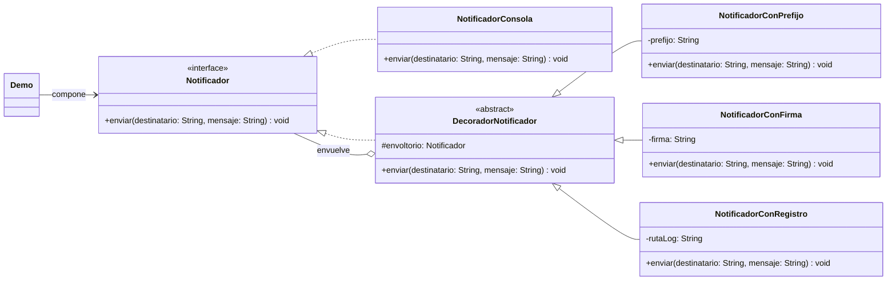

# Ejercicio guiado: Decorator 🧩🧰

> Patrón estructural (POO). En este ejercicio vas a aplicar **Decorator** para añadir capacidades a un objeto **en tiempo de ejecución** mediante **composición** (envoltorios), sin modificar la clase original.

## Enunciado / Introducción 🏫📣

Estás construyendo **CampusAlert**, una mini-app de consola para enviar avisos rápidos (incidencias, recordatorios, alertas de mantenimiento…) a distintos “destinatarios” (un aula, un grupo, un usuario, etc.).

La idea base es muy simple: un `Notificador` que “envía” un mensaje (en este ejercicio lo imprimirá por consola).

Pero el equipo te pide **añadir funcionalidades opcionales** que deben poder combinarse sin crear mil subclases:

- Añadir un **prefijo** estándar al mensaje (por ejemplo, `[ALERTA]`).
- Añadir una **firma** al final del mensaje (por ejemplo, `— Soporte ACING`).
- Guardar un **registro (log)** de lo enviado en un fichero de texto.

🎯 Objetivo: poder montar configuraciones como:

- `Registro(Firma(Prefijo(Consola)))`
- `Firma(Registro(Prefijo(Consola)))`

…sin cambiar el cliente y sin reescribir clases ya existentes.

### Diagrama de clases (objetivo) 🗺️

El siguiente diagrama resume la estructura que vas a implementar: un **componente** (`Notificador`), un **componente concreto** (`NotificadorConsola`) y varios **decoradores** que envuelven a otro `Notificador`.



Este ejercicio está inspirado en:
- Las transparencias: `5-Decorator.pdf`
- El ejemplo base (misma estructura, distinta temática): `./code/es/uva/poo/decorator/`

---

## Qué vas a construir 🧱

1. **Componente (interfaz)**: `Notificador`
2. **Componente concreto**: `NotificadorConsola`
3. **Decorador base**: `DecoradorNotificador` (envuelve a otro `Notificador` y delega)
4. **Decoradores concretos**:
   - `NotificadorConPrefijo`
   - `NotificadorConFirma`
   - `NotificadorConRegistro`
5. **Cliente (main)**: `Demo` que compone decoradores y prueba combinaciones

> Recomendación: crea un paquete nuevo para el ejercicio, por ejemplo `es.uva.poo.decorator.campusalert`.

---

## Pasos para la implementación (guiados) 🧭

### 1) Crea el **Componente**: `Notificador` 📬

Define la interfaz común. Importante: decoradores y componentes concretos deben implementar **la misma interfaz**.

```java
public interface Notificador {
    void enviar(String destinatario, String mensaje);
}
```

### 2) Implementa el **Componente concreto**: `NotificadorConsola` 🖥️

Este será el comportamiento base. En este ejercicio basta con imprimir algo tipo:

- `Para: <destinatario>`
- `Mensaje: <mensaje>`

Plantilla:

```java
public class NotificadorConsola implements Notificador {

    @Override
    public void enviar(String destinatario, String mensaje) {
        // TODO: imprimir el destinatario y el mensaje
    }
}
```

### 3) Implementa el **Decorador base**: `DecoradorNotificador` 🎁

Debe:
- Implementar `Notificador`
- Guardar una referencia al `Notificador` envuelto
- Delegar por defecto

Plantilla:

```java
public abstract class DecoradorNotificador implements Notificador {

    protected final Notificador envoltorio;

    protected DecoradorNotificador(Notificador envoltorio) {
        this.envoltorio = envoltorio;
    }

    @Override
    public void enviar(String destinatario, String mensaje) {
        // Delegación por defecto
        envoltorio.enviar(destinatario, mensaje);
    }
}
```

### 4) Decorador concreto 1: `NotificadorConPrefijo` 🏷️

Añade un prefijo al **inicio** del mensaje.

Pistas:
- Recibe el `prefijo` en el constructor.
- En `enviar(...)`, construye `mensajeConPrefijo` y delega.

```java
public class NotificadorConPrefijo extends DecoradorNotificador {

    private final String prefijo;

    public NotificadorConPrefijo(Notificador envoltorio, String prefijo) {
        super(envoltorio);
        this.prefijo = prefijo;
    }

    @Override
    public void enviar(String destinatario, String mensaje) {
        // TODO: crear un nuevo mensaje con el prefijo
        // TODO: delegar en el envoltorio
    }
}
```

### 5) Decorador concreto 2: `NotificadorConFirma` ✍️

Añade una firma al **final** del mensaje (por ejemplo, separada con un salto de línea).

```java
public class NotificadorConFirma extends DecoradorNotificador {

    private final String firma;

    public NotificadorConFirma(Notificador envoltorio, String firma) {
        super(envoltorio);
        this.firma = firma;
    }

    @Override
    public void enviar(String destinatario, String mensaje) {
        // TODO: construir mensaje + "\n" + firma
        // TODO: delegar
    }
}
```

### 6) Decorador concreto 3: `NotificadorConRegistro` 🧾

Antes (o después) de delegar, guarda una línea en un fichero (por ejemplo `campusalert.log`) con:

- fecha/hora
- destinatario
- un resumen del mensaje

Sugerencias:
- Usa `FileWriter` en modo *append*.
- En este ejercicio puedes gestionar excepciones con `RuntimeException` para simplificar.

Plantilla:

```java
public class NotificadorConRegistro extends DecoradorNotificador {

    private final String rutaLog;

    public NotificadorConRegistro(Notificador envoltorio, String rutaLog) {
        super(envoltorio);
        this.rutaLog = rutaLog;
    }

    @Override
    public void enviar(String destinatario, String mensaje) {
        // TODO: escribir una línea de log en rutaLog
        // TODO: delegar (llamar a super.enviar o envoltorio.enviar)
    }
}
```

### 7) Comprueba que **el orden importa** 🔀

Prueba dos pilas:

- `Registro(Firma(Prefijo(Consola)))`
- `Firma(Registro(Prefijo(Consola)))`

Preguntas para pensar:
- ¿Qué queda registrado en el fichero en cada caso?
- ¿La firma aparece en el log o no?

---

## Código cliente (Demo / main) 🧪

> Este `main` es el **cliente**: compone los decoradores y prueba el comportamiento.

```java
package es.uva.poo.decorator.campusalert;

public class Demo {

    public static void main(String[] args) {
        Notificador notificador = new NotificadorConRegistro(
                new NotificadorConFirma(
                        new NotificadorConPrefijo(
                                new NotificadorConsola(),
                                "[ALERTA CAMPUS] "
                        ),
                        "-- Soporte ACING"
                ),
                "campusalert.log"
        );

        notificador.enviar("Aula 3.12", "El proyector no detecta señal HDMI.");
        notificador.enviar("Biblioteca", "Corte programado de WiFi a las 18:00.");

        System.out.println("\nRevisa el fichero campusalert.log para ver el registro.");
    }
}
```

---

<details>
  <summary>Necesitas ayuda con el código</summary>
<br>

#### Notificador.java

```java
package es.uva.poo.decorator.campusalert;

public interface Notificador {
    void enviar(String destinatario, String mensaje);
}
```

#### NotificadorConsola.java

```java
package es.uva.poo.decorator.campusalert;

public class NotificadorConsola implements Notificador {

    @Override
    public void enviar(String destinatario, String mensaje) {
        System.out.println("Para: " + destinatario);
        System.out.println("Mensaje: " + mensaje);
        System.out.println("---");
    }
}
```

#### DecoradorNotificador.java

```java
package es.uva.poo.decorator.campusalert;

public abstract class DecoradorNotificador implements Notificador {

    protected final Notificador envoltorio;

    protected DecoradorNotificador(Notificador envoltorio) {
        this.envoltorio = envoltorio;
    }

    @Override
    public void enviar(String destinatario, String mensaje) {
        envoltorio.enviar(destinatario, mensaje);
    }
}
```

#### NotificadorConPrefijo.java

```java
package es.uva.poo.decorator.campusalert;

import java.util.Objects;

public class NotificadorConPrefijo extends DecoradorNotificador {

    private final String prefijo;

    public NotificadorConPrefijo(Notificador envoltorio, String prefijo) {
        super(Objects.requireNonNull(envoltorio, "El envoltorio no puede ser null"));
        this.prefijo = prefijo != null ? prefijo : "";
    }

    @Override
    public void enviar(String destinatario, String mensaje) {
        String base = mensaje != null ? mensaje : "";
        String mensajeConPrefijo = prefijo + base;
        super.enviar(destinatario, mensajeConPrefijo);
    }
}
```

#### NotificadorConFirma.java

```java
package es.uva.poo.decorator.campusalert;

import java.util.Objects;

public class NotificadorConFirma extends DecoradorNotificador {

    private final String firma;

    public NotificadorConFirma(Notificador envoltorio, String firma) {
        super(Objects.requireNonNull(envoltorio, "El envoltorio no puede ser null"));
        this.firma = firma != null ? firma : "";
    }

    @Override
    public void enviar(String destinatario, String mensaje) {
        String base = mensaje != null ? mensaje : "";
        String mensajeConFirma = base + "\n" + firma;
        super.enviar(destinatario, mensajeConFirma);
    }
}
```

#### NotificadorConRegistro.java

```java
package es.uva.poo.decorator.campusalert;

import java.io.FileWriter;
import java.io.IOException;
import java.time.LocalDateTime;
import java.util.Objects;

public class NotificadorConRegistro extends DecoradorNotificador {

    private final String rutaLog;

    public NotificadorConRegistro(Notificador envoltorio, String rutaLog) {
        super(Objects.requireNonNull(envoltorio, "El envoltorio no puede ser null"));
        this.rutaLog = (rutaLog == null || rutaLog.trim().isEmpty()) ? "campusalert.log" : rutaLog;
    }

    @Override
    public void enviar(String destinatario, String mensaje) {
        escribirLog(destinatario, mensaje);
        super.enviar(destinatario, mensaje);
    }

    private void escribirLog(String destinatario, String mensaje) {
        String d = destinatario != null ? destinatario : "";
        String m = mensaje != null ? mensaje : "";

        // Resumen (evita logs gigantes)
        String resumen = m.replace("\n", " ");
        if (resumen.length() > 80) {
            resumen = resumen.substring(0, 80) + "...";
        }

        String linea = String.format("%s | para=%s | %s%n", LocalDateTime.now(), d, resumen);

        try (FileWriter fw = new FileWriter(rutaLog, true)) {
            fw.write(linea);
        } catch (IOException e) {
            throw new RuntimeException("No se pudo escribir el log: " + rutaLog, e);
        }
    }
}
```

#### Demo.java

```java
package es.uva.poo.decorator.campusalert;

public class Demo {

    public static void main(String[] args) {
        Notificador notificador = new NotificadorConRegistro(
                new NotificadorConFirma(
                        new NotificadorConPrefijo(
                                new NotificadorConsola(),
                                "[ALERTA CAMPUS] "
                        ),
                        "-- Soporte ACING"
                ),
                "campusalert.log"
        );

        notificador.enviar("Aula 3.12", "El proyector no detecta señal HDMI.");
        notificador.enviar("Biblioteca", "Corte programado de WiFi a las 18:00.");

        // Cambia el orden y observa el log
        Notificador alternativa = new NotificadorConFirma(
                new NotificadorConRegistro(
                        new NotificadorConPrefijo(new NotificadorConsola(), "[INFO] "),
                        "campusalert.log"
                ),
                "-- Equipo de Sistemas"
        );

        alternativa.enviar("Secretaría", "Recordatorio: reunión a las 12:30.");
    }
}
```

</details>
<br>
