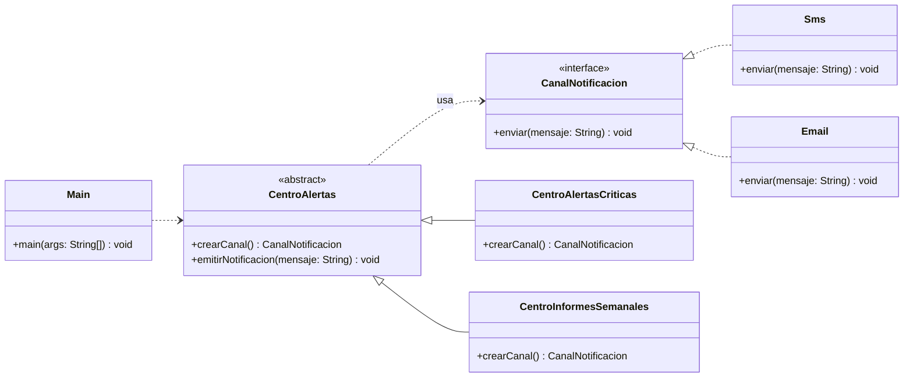

# Ejercicio guiado: Factory Method 🏭

> Patrón creacional (POO). En este ejercicio vas a aplicar **Factory Method** para desacoplar la lógica de negocio de la creación de objetos.

## Enunciado / Introducción 🧩

En **Banca Segura App** se envían notificaciones a los usuarios cuando ocurren ciertos eventos:

- **Alertas críticas** (por ejemplo: intento de acceso sospechoso) → deben salir por **SMS**.
- **Comunicaciones informativas** (por ejemplo: resumen semanal) → se mandan por **Email**.

El código “antiguo” creaba el canal con `new Sms()` o `new Email()` desde muchos puntos del sistema. A medida que crecen los casos de uso, aparecen `if/else` por todas partes y el acoplamiento se dispara.

Tu objetivo es refactorizar el diseño para que:

- La lógica de negocio (enviar la notificación) **no dependa** de clases concretas (`Sms`, `Email`).
- La creación del objeto se delegue en un **método fábrica**.
- Añadir un nuevo canal (Push, WhatsApp, etc.) sea tan simple como añadir una nueva subclase del creador (principio *abierto/cerrado*).

Diagrama de clases (orientativo) de lo que se quiere construir:



Este ejercicio está inspirado en:
- Las transparencias: `2-FactoryMethod.pdf`
- El ejemplo de referencia (misma estructura, distinta temática): `./code/es/uva/poo/factorymethod/`

---

## Qué vas a construir 🧱

Una mini-aplicación con:

1. **Producto**: `CanalNotificacion` (interfaz)
2. **Productos concretos**: `Sms`, `Email`
3. **Creador**: `CentroAlertas` (abstracta)
4. **Creadores concretos**: `CentroAlertasCriticas`, `CentroInformesSemanales`
5. **Cliente**: `Main` (prueba de funcionamiento)

---

## Pasos para la implementación (guiados) 🧭

> Recomendación: usa el mismo paquete que en el ejemplo (`es.uva.poo.factorymethod`) o uno equivalente en tu proyecto.

### 1) Define el **Producto** (`CanalNotificacion`) 📣

Crea la interfaz `CanalNotificacion` con una única operación:

- `void enviar(String mensaje);`

Pista: el cliente y la lógica de negocio deben hablar siempre con `CanalNotificacion`, nunca con `Sms`/`Email`.

Plantilla mínima:

```java
public interface CanalNotificacion {
    void enviar(String mensaje);
}
```

### 2) Implementa dos **Productos concretos** (`Sms`, `Email`) 📱✉️

Crea `Sms` y `Email` implementando `CanalNotificacion`.

- `Sms.enviar(mensaje)` imprime un texto tipo `[SMS] ...`.
- `Email.enviar(mensaje)` imprime un texto tipo `[EMAIL] ...`.

Plantilla sugerida (rellena el mensaje):

```java
public class Sms implements CanalNotificacion {
    @Override
    public void enviar(String mensaje) {
        // TODO: imprime "[SMS] " + mensaje
    }
}
```

```java
public class Email implements CanalNotificacion {
    @Override
    public void enviar(String mensaje) {
        // TODO: imprime "[EMAIL] " + mensaje
    }
}
```

### 3) Crea el **Creador** abstracto (`CentroAlertas`) 🏗️

Crea una clase abstracta `CentroAlertas` con:

- El **Factory Method**: `public abstract CanalNotificacion crearCanal();`
- La lógica de negocio: `public void emitirNotificacion(String mensaje)`

Regla importante:
- `emitirNotificacion(...)` **no** debe saber si el canal es SMS o Email.

Plantilla (rellena los TODO):

```java
public abstract class CentroAlertas {

    public abstract CanalNotificacion crearCanal();

    public void emitirNotificacion(String mensaje) {
        // TODO: pide el producto al factory method
        // CanalNotificacion canal = ...

        // TODO: usa el producto sin conocer la clase concreta
        // canal.enviar(mensaje);
    }
}
```

### 4) Implementa los **Creadores concretos** 🧰

Crea dos subclases:

- `CentroAlertasCriticas` → devuelve `new Sms()`.
- `CentroInformesSemanales` → devuelve `new Email()`.

Plantilla:

```java
public class CentroAlertasCriticas extends CentroAlertas {
    @Override
    public CanalNotificacion crearCanal() {
        // TODO: devolver el canal para alertas críticas
        return null;
    }
}
```

```java
public class CentroInformesSemanales extends CentroAlertas {
    @Override
    public CanalNotificacion crearCanal() {
        // TODO: devolver el canal para informes
        return null;
    }
}
```

### 5) Añade el **código cliente** (`Main`) ✅

El cliente crea un `CentroAlertas` concreto y llama a `emitirNotificacion(...)`. Fíjate que **el cliente no necesita llamar a `new Sms()` o `new Email()`**.

Crea y ejecuta este `Main` para comprobarlo.

---

## Código cliente (Main) 🧪

> Este es el código de prueba que debe funcionar cuando termines la implementación.

```java
package es.uva.poo.factorymethod;

public class Main {

    public static void main(String[] args) {
        System.out.println("--- Alerta crítica ---");
        CentroAlertas alertas = new CentroAlertasCriticas();
        alertas.emitirNotificacion("Intento de acceso sospechoso");

        System.out.println("\n--- Informe semanal ---");
        CentroAlertas informes = new CentroInformesSemanales();
        informes.emitirNotificacion("Tu resumen semanal está listo");
    }
}
```

Salida orientativa (puede variar el texto):

```text
--- Alerta crítica ---
[SMS] Intento de acceso sospechoso

--- Informe semanal ---
[EMAIL] Tu resumen semanal está listo
```

---

## Extensión opcional (sube nota) 🌟

Añade un tercer canal de notificación:

- `Push` (producto concreto)
- `CentroPromociones` (creador concreto)

Objetivo: que no tengas que modificar `Logistica` para añadir el nuevo transporte.

---

<details>
  <summary>Necesitas ayuda con el código (solución completa) 🛟</summary>
<br>

#### CanalNotificacion.java

```java
package es.uva.poo.factorymethod;

public interface CanalNotificacion {
    void enviar(String mensaje);
}
```

#### Sms.java

```java
package es.uva.poo.factorymethod;

public class Sms implements CanalNotificacion {

    @Override
    public void enviar(String mensaje) {
        System.out.println("[SMS] " + mensaje);
    }
}
```

#### Email.java

```java
package es.uva.poo.factorymethod;

public class Email implements CanalNotificacion {

    @Override
    public void enviar(String mensaje) {
        System.out.println("[EMAIL] " + mensaje);
    }
}
```

#### CentroAlertas.java

```java
package es.uva.poo.factorymethod;

public abstract class CentroAlertas {

    // Factory Method
    public abstract CanalNotificacion crearCanal();

    // Lógica de negocio (no depende de clases concretas)
    public void emitirNotificacion(String mensaje) {
        CanalNotificacion canal = crearCanal();
        canal.enviar(mensaje);
    }
}
```

#### CentroAlertasCriticas.java

```java
package es.uva.poo.factorymethod;

public class CentroAlertasCriticas extends CentroAlertas {

    @Override
    public CanalNotificacion crearCanal() {
        return new Sms();
    }
}
```

#### CentroInformesSemanales.java

```java
package es.uva.poo.factorymethod;

public class CentroInformesSemanales extends CentroAlertas {

    @Override
    public CanalNotificacion crearCanal() {
        return new Email();
    }
}
```

#### Main.java

```java
package es.uva.poo.factorymethod;

public class Main {

    public static void main(String[] args) {
        System.out.println("--- Alerta crítica ---");
        CentroAlertas alertas = new CentroAlertasCriticas();
        alertas.emitirNotificacion("Intento de acceso sospechoso");

        System.out.println("\n--- Informe semanal ---");
        CentroAlertas informes = new CentroInformesSemanales();
        informes.emitirNotificacion("Tu resumen semanal está listo");
    }
}
```

</details>
<br>
