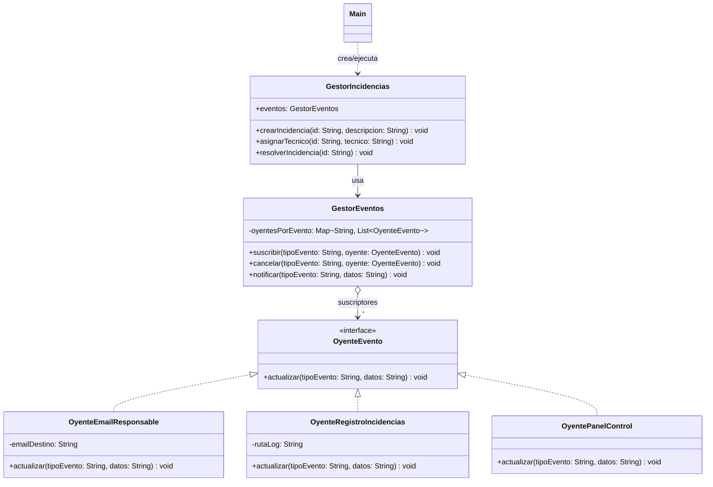

# Ejercicio guiado: Observer 👀

> Patrón de comportamiento (POO). En este ejercicio vas a aplicar **Observer** para desacoplar un emisor de eventos de quienes reaccionan a esos eventos.

## Enunciado / Introducción 🧩

En **CampusFix** (un sistema ficticio de mantenimiento del campus) se registran incidencias como “proyector roto”, “sin Wi‑Fi” o “puerta atascada”.

Cuando ocurre algo importante, varias partes del sistema quieren enterarse:

- El **equipo de mantenimiento** quiere ver los cambios en un **panel**.
- El **responsable** quiere recibir una **notificación por email**.
- El sistema debe dejar un **registro (log)** en un fichero por auditoría.

El problema: si `GestorIncidencias` llama directamente a `new Email...`, `new Panel...`, `new Logger...`, el acoplamiento se dispara y cualquier nuevo “interesado” obliga a modificar el publicador.

Tu objetivo es diseñar el sistema con **Observer** para que:

- `GestorIncidencias` **no conozca** clases concretas de notificación.
- Los “interesados” puedan **suscribirse** y **cancelar** suscripciones en tiempo de ejecución.
- El publicador notifique **solo a los que están suscritos** a cada tipo de evento.

Este ejercicio está inspirado en:
- Las transparencias: `./Transpas/7-Observer.md`
- El ejemplo de referencia (misma estructura, distinta temática): `./code/es/uva/poo/observer/`

---

## Qué vas a construir 🧱

Una mini-aplicación con:

1. **Observer (interfaz)**: `OyenteEvento`
2. **Gestor de suscripciones (Publisher helper)**: `GestorEventos` (suscripción por *tipo de evento*)
3. **Publicador concreto (Concrete Publisher)**: `GestorIncidencias`
4. **Observers concretos (Concrete Observers)**:
   - `OyenteEmailResponsable`
   - `OyenteRegistroIncidencias`
   - `OyentePanelControl`
5. **Cliente**: `Main` (código de pruebas)

---

## Diagrama de clases (Mermaid) 🗺️

> Orientativo: puedes añadir atributos internos si lo necesitas, pero respeta los roles.



---

## Código cliente (Main) 🧪

> Este es el código de prueba que debe funcionar cuando termines la implementación.
>
> Recomendación: usa el paquete `es.uva.poo.observer` o uno equivalente en tu proyecto.

```java
package es.uva.poo.observer;

public class Main {

    public static void main(String[] args) {
        GestorIncidencias gestor = new GestorIncidencias();

        OyenteEvento email = new OyenteEmailResponsable("mantenimiento@uva.es");
        OyenteEvento log = new OyenteRegistroIncidencias("incidencias.log");
        OyenteEvento panel = new OyentePanelControl();

        // Suscribimos interesados por tipo de evento
        gestor.eventos.suscribir("crear", email);
        gestor.eventos.suscribir("resolver", email);

        gestor.eventos.suscribir("crear", log);
        gestor.eventos.suscribir("asignar", log);
        gestor.eventos.suscribir("resolver", log);

        gestor.eventos.suscribir("crear", panel);
        gestor.eventos.suscribir("asignar", panel);
        gestor.eventos.suscribir("resolver", panel);

        System.out.println("--- Flujo de ejemplo ---");
        gestor.crearIncidencia("INC-17", "Proyector del aula 2.1 no enciende");
        gestor.asignarTecnico("INC-17", "Laura");

        // Caso interesante: el panel se da de baja de un evento en runtime
        gestor.eventos.cancelar("resolver", panel);

        gestor.resolverIncidencia("INC-17");
    }
}
```

Salida orientativa (puede variar el texto):

```text
--- Flujo de ejemplo ---
[PANEL] crear -> INC-17 | Proyector del aula 2.1 no enciende
[EMAIL -> mantenimiento@uva.es] crear -> INC-17 | Proyector del aula 2.1 no enciende

[PANEL] asignar -> INC-17 | Técnico: Laura

// Nota: aquí ya NO aparece el panel en "resolver" porque se canceló la suscripción
[EMAIL -> mantenimiento@uva.es] resolver -> INC-17
```

---

## Pasos para la implementación (guiados) 🧭

### 1) Define la interfaz **Observer** (`OyenteEvento`) 👂

Debe tener un único método:

- `void actualizar(String tipoEvento, String datos);`

La idea clave: **el publicador solo conocerá esta interfaz**, no clases concretas.

Plantilla mínima:

```java
public interface OyenteEvento {
    void actualizar(String tipoEvento, String datos);
}
```

### 2) Implementa el gestor de suscripciones (`GestorEventos`) 🧾

`GestorEventos` mantiene una colección de oyentes **por tipo de evento**.

Requisitos:

- `suscribir(tipoEvento, oyente)`: añade el oyente a ese evento.
- `cancelar(tipoEvento, oyente)`: elimina el oyente de ese evento.
- `notificar(tipoEvento, datos)`: recorre los suscritos y llama a `actualizar(...)`.

Pistas:

- Usa un `Map<String, List<OyenteEvento>>`.
- Si un oyente se desuscribe durante una notificación, puedes evitar problemas usando una **copia defensiva** de la lista antes de iterar.

Plantilla sugerida (rellena los TODO):

```java
public class GestorEventos {

    // TODO: Map<String, List<OyenteEvento>> oyentesPorEvento = ...

    public void suscribir(String tipoEvento, OyenteEvento oyente) {
        // TODO
    }

    public void cancelar(String tipoEvento, OyenteEvento oyente) {
        // TODO
    }

    public void notificar(String tipoEvento, String datos) {
        // TODO
        // 1) localizar oyentes suscritos
        // 2) (opcional) snapshot/copia defensiva
        // 3) notificar invocando oyente.actualizar(tipoEvento, datos)
    }
}
```

### 3) Crea el **publicador** (`GestorIncidencias`) 🏢

Esta clase representa el “sistema” donde ocurren cosas. Debe:

- Tener un atributo `public final GestorEventos eventos;`
- Disparar notificaciones cuando ocurren acciones:
  - `crearIncidencia(...)` → `notificar("crear", ...)`
  - `asignarTecnico(...)` → `notificar("asignar", ...)`
  - `resolverIncidencia(...)` → `notificar("resolver", ...)`

Importante:

- `GestorIncidencias` **no debe** instanciar `OyenteEmailResponsable`/`OyentePanelControl`/etc.
- Solo debe emitir eventos.

Plantilla sugerida:

```java
public class GestorIncidencias {

    public final GestorEventos eventos;

    public GestorIncidencias() {
        this.eventos = new GestorEventos();
    }

    public void crearIncidencia(String id, String descripcion) {
        // TODO: compón los datos y notifica "crear"
    }

    public void asignarTecnico(String id, String tecnico) {
        // TODO: compón los datos y notifica "asignar"
    }

    public void resolverIncidencia(String id) {
        // TODO: notifica "resolver"
    }
}
```

### 4) Implementa los **observadores concretos** 🧰

Implementa 3 clases que hagan cosas distintas al recibir un evento:

- `OyenteEmailResponsable`: imprime por consola un mensaje tipo `[EMAIL -> destino] ...`.
- `OyenteRegistroIncidencias`: añade una línea a un fichero (por ejemplo `incidencias.log`).
- `OyentePanelControl`: imprime por consola algo tipo `[PANEL] ...`.

Plantilla de ejemplo para uno de ellos:

```java
public class OyentePanelControl implements OyenteEvento {
    @Override
    public void actualizar(String tipoEvento, String datos) {
        // TODO: mostrar en consola
    }
}
```

### 5) Ejecuta el cliente (`Main`) ✅

- Copia el `Main` de la sección “Código cliente”.
- Comprueba que:
  - Se notifican eventos a varios oyentes.
  - Al cancelar una suscripción, ese oyente deja de recibir ese tipo de evento.

---

## Extensión opcional (sube nota) 🌟

Añade un nuevo observador:

- `OyenteMetricas`: cuenta cuántas incidencias se han creado y resuelto y lo imprime cada vez que reciba un evento.

Objetivo: **no tocar** `GestorIncidencias` para añadir el nuevo comportamiento.

---

<details>
  <summary>Necesitas ayuda con el código.</summary>
<br>

#### OyenteEvento.java


```java
package es.uva.poo.observer;

public interface OyenteEvento {
    void actualizar(String tipoEvento, String datos);
}
```

#### GestorEventos.java


```java
package es.uva.poo.observer;

public class GestorEventos {

    // Mapa: tipo de evento -> lista de oyentes
    private final java.util.Map<String, java.util.List<OyenteEvento>> oyentesPorEvento = new java.util.HashMap<>();

    public void suscribir(String tipoEvento, OyenteEvento oyente) {
        oyentesPorEvento
                .computeIfAbsent(tipoEvento, k -> new java.util.ArrayList<>())
                .add(oyente);
    }

    public void cancelar(String tipoEvento, OyenteEvento oyente) {
        java.util.List<OyenteEvento> oyentes = oyentesPorEvento.get(tipoEvento);
        if (oyentes == null) {
            return;
        }
        oyentes.remove(oyente);
    }

    public void notificar(String tipoEvento, String datos) {
        java.util.List<OyenteEvento> oyentes = oyentesPorEvento.get(tipoEvento);
        if (oyentes == null) {
            return;
        }

        // Copia defensiva para evitar problemas si la lista cambia durante la notificación.
        java.util.List<OyenteEvento> snapshot = new java.util.ArrayList<>(oyentes);
        for (OyenteEvento oyente : snapshot) {
            oyente.actualizar(tipoEvento, datos);
        }
    }
}
```

#### GestorIncidencias.java


```java
package es.uva.poo.observer;

public class GestorIncidencias {

    public final GestorEventos eventos;

    public GestorIncidencias() {
        this.eventos = new GestorEventos();
    }

    public void crearIncidencia(String id, String descripcion) {
        String datos = id + " | " + descripcion;
        eventos.notificar("crear", datos);
    }

    public void asignarTecnico(String id, String tecnico) {
        String datos = id + " | Técnico: " + tecnico;
        eventos.notificar("asignar", datos);
    }

    public void resolverIncidencia(String id) {
        eventos.notificar("resolver", id);
    }
}
```

#### OyenteEmailResponsable.java


```java
package es.uva.poo.observer;

public class OyenteEmailResponsable implements OyenteEvento {

    private final String emailDestino;

    public OyenteEmailResponsable(String emailDestino) {
        this.emailDestino = emailDestino;
    }

    @Override
    public void actualizar(String tipoEvento, String datos) {
        System.out.printf("[EMAIL -> %s] %s -> %s%n", emailDestino, tipoEvento, datos);
    }
}
```

#### OyenteRegistroIncidencias.java


```java
package es.uva.poo.observer;

public class OyenteRegistroIncidencias implements OyenteEvento {

    private final String rutaLog;

    public OyenteRegistroIncidencias(String rutaLog) {
        this.rutaLog = rutaLog;
    }

    @Override
    public void actualizar(String tipoEvento, String datos) {
        String linea = String.format("%s - %s -> %s%n", java.time.LocalDateTime.now(), tipoEvento, datos);

        try (java.io.FileWriter writer = new java.io.FileWriter(rutaLog, true)) {
            writer.write(linea);
        } catch (java.io.IOException ex) {
            System.err.println("No se pudo escribir en el log '" + rutaLog + "': " + ex.getMessage());
        }
    }
}
```

#### OyentePanelControl.java


```java
package es.uva.poo.observer;

public class OyentePanelControl implements OyenteEvento {
    @Override
    public void actualizar(String tipoEvento, String datos) {
        System.out.println("[PANEL] " + tipoEvento + " -> " + datos);
    }
}
```

#### Main.java


```java
package es.uva.poo.observer;

public class Main {

    public static void main(String[] args) {
        GestorIncidencias gestor = new GestorIncidencias();

        OyenteEvento email = new OyenteEmailResponsable("mantenimiento@uva.es");
        OyenteEvento log = new OyenteRegistroIncidencias("incidencias.log");
        OyenteEvento panel = new OyentePanelControl();

        gestor.eventos.suscribir("crear", email);
        gestor.eventos.suscribir("resolver", email);

        gestor.eventos.suscribir("crear", log);
        gestor.eventos.suscribir("asignar", log);
        gestor.eventos.suscribir("resolver", log);

        gestor.eventos.suscribir("crear", panel);
        gestor.eventos.suscribir("asignar", panel);
        gestor.eventos.suscribir("resolver", panel);

        System.out.println("--- Flujo de ejemplo ---");
        gestor.crearIncidencia("INC-17", "Proyector del aula 2.1 no enciende");
        gestor.asignarTecnico("INC-17", "Laura");

        gestor.eventos.cancelar("resolver", panel);

        gestor.resolverIncidencia("INC-17");
    }
}
```

</details>
<br>
