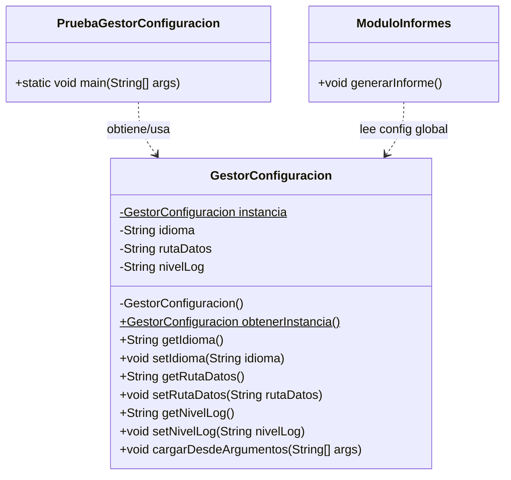

# Ejercicio guiado: Singleton 🧩

## Enunciado / introducción

Imagina que estás construyendo una pequeña aplicación de escritorio para un centro de formación: **ACING-Desk**. La aplicación tiene varios “módulos” (matrículas, informes, avisos al alumno) y todos necesitan leer la misma configuración global:

- Idioma de la interfaz.
- Ruta donde se guardan los ficheros de datos.
- Nivel de logs (INFO/DEBUG).

El problema: si cada módulo crea su propia configuración, acabarás con comportamientos incoherentes (cada uno “cree” que la app está configurada de una forma distinta). 😵‍💫

Tu objetivo es implementar un **Gestor de Configuración** usando el patrón **Singleton** para garantizar:

1. Que exista **una sola instancia** de la configuración en toda la aplicación.
2. Que exista un **punto de acceso global** controlado para obtener esa instancia.

### ¿Cuál es el “código cliente” que debe funcionar? 👇

Diagrama de clases orientativo (estructura objetivo del ejercicio):



En este ejercicio, el **código cliente** (el que “consume” tu Singleton) será una clase de prueba con este punto de entrada:

```java
package es.uva.poo.singleton;

public class PruebaGestorConfiguracion {

    public static void main(String[] args) {
        System.out.println("--- Inicio de la prueba del Singleton (GestorConfiguracion) ---");

        System.out.println("1. Solicitando primera referencia a la configuración...");
        GestorConfiguracion c1 = GestorConfiguracion.obtenerInstancia();

        System.out.println("2. Solicitando segunda referencia a la configuración...");
        GestorConfiguracion c2 = GestorConfiguracion.obtenerInstancia();

        System.out.println("\n3. Verificando identidad de objetos:");
        if (c1 == c2) {
            System.out.println("   [ÉXITO] c1 y c2 apuntan al MISMO objeto.");
            System.out.println("   Referencia c1: " + c1);
            System.out.println("   Referencia c2: " + c2);
        } else {
            System.out.println("   [ERROR] c1 y c2 son objetos DIFERENTES.");
        }

        System.out.println("\n4. Cambiando configuración desde c1...");
        c1.setNivelLog("DEBUG");
        c1.setIdioma("en");

        System.out.println("   Leyendo nivelLog desde c2: " + c2.getNivelLog());
        System.out.println("   Leyendo idioma desde c2: " + c2.getIdioma());

        System.out.println("\n5. Ejecutando un módulo que consume la configuración...");
        ModuloInformes modulo = new ModuloInformes();
        modulo.generarInforme();

        System.out.println("--- Fin de la prueba ---");
    }
}
```

Este fichero es el que debes ejecutar. Si tu Singleton está bien, deberías ver que:

- El paso 3 indica `[ÉXITO]`.
- Los valores leídos desde `c2` reflejan el cambio hecho con `c1`.

Tu trabajo consiste en implementar `GestorConfiguracion` (y el resto de clases del ejercicio) de forma que, **al ejecutar ese `main`**, se cumpla lo siguiente:

- Solo se crea **una** instancia real de `GestorConfiguracion`.
- Dos variables distintas (`c1` y `c2`) apuntan al **mismo objeto** (la comprobación `c1 == c2` debe dar verdadero).
- Si se cambia un valor desde `c1`, al leerlo desde `c2` se ve el **mismo cambio**.

Te basarás en:
- Las transparencias: `1-Singleton.pdf`
- El ejemplo base: `./code/es/uva/poo/singleton/Singleton.java` y `./code/es/uva/poo/singleton/PruebaSingleton.java`

---

## Pasos para la implementación ✅

### 1) Crea la clase `GestorConfiguracion`

En el paquete `es.uva.poo.singleton`, crea una clase nueva llamada `GestorConfiguracion`.

Requisitos del Singleton (según las transparencias):
- Constructor **privado**.
- Campo estático privado con la instancia.
- Método estático público `obtenerInstancia()` que devuelva siempre la misma instancia.

Además, esta clase debe almacenar estos valores:
- `idioma` (por defecto: `"es"`)
- `rutaDatos` (por defecto: `"data/"`)
- `nivelLog` (por defecto: `"INFO"`)

Pista (estructura mínima, rellena los TODO):

```java
package es.uva.poo.singleton;

public class GestorConfiguracion {

    // TODO: campo estático privado para la instancia única

    // TODO: atributos de configuración (idioma, rutaDatos, nivelLog)

    // TODO: constructor privado (inicializa valores por defecto)

    public static GestorConfiguracion obtenerInstancia() {
        // TODO: lazy initialization: crear solo si es null
        return null; // TODO
    }

    // TODO: getters (getIdioma, getRutaDatos, getNivelLog)

    // TODO: setters (setIdioma, setRutaDatos, setNivelLog)
}
```

Notas:
- Mantén el estilo del ejemplo (`obtenerInstancia()`).
- La inicialización debe ser “perezosa” (lazy): se crea la instancia la primera vez que se pide.

---

### 2) Crea un “módulo” que use la configuración

Crea una clase sencilla `ModuloInformes` (en el mismo paquete) que, al ejecutarse, lea la configuración global y muestre un mensaje.

Objetivo: **no** recibir `GestorConfiguracion` por constructor, sino acceder de forma global (como se hace en Singleton).

```java
package es.uva.poo.singleton;

public class ModuloInformes {

    public void generarInforme() {
        // TODO: obtener la instancia del GestorConfiguracion
        // TODO: mostrar por consola algo como:
        // "Generando informe en idioma=es, rutaDatos=data/, nivelLog=INFO"
    }
}
```

---

### 3) Programa de prueba (similar a `PruebaSingleton`)

Crea una clase `PruebaGestorConfiguracion` con `main` (este será el **cliente** del Singleton) que:

1. Pida la instancia dos veces (`c1` y `c2`).
2. Compruebe con `==` que son el **mismo objeto**.
3. Cambie la configuración desde `c1` (por ejemplo, `nivelLog = "DEBUG"`).
4. Compruebe que al leer desde `c2` se ve el mismo cambio.
5. Ejecute `ModuloInformes.generarInforme()`.

Pistas:
- Copia la estructura de salida de `PruebaSingleton.java`.
- Si tu comprobación `c1 == c2` falla, el Singleton está mal implementado. ⚠️

Recomendación: imprime mensajes paso a paso (1., 2., 3., …) para que sea fácil verificar la ejecución.

---

### 4) Mini-reto (opcional) 🧪

Añade un método:

- `public void cargarDesdeArgumentos(String[] args)`

Idea: permitir argumentos simples como `--idioma=en`, `--ruta=./datos/`, `--log=DEBUG`.

No hace falta que sea “perfecto”; con separar por `=` y comprobar el prefijo vale.

---

<details>
  <summary>Necesitas ayuda con el código.</summary>
<br>

#### GestorConfiguracion.java

Omito imports para no hacerlo tan largo.

```java
package es.uva.poo.singleton;

public class GestorConfiguracion {

    private static GestorConfiguracion instancia;

    private String idioma;
    private String rutaDatos;
    private String nivelLog;

    private GestorConfiguracion() {
        this.idioma = "es";
        this.rutaDatos = "data/";
        this.nivelLog = "INFO";
    }

    public static GestorConfiguracion obtenerInstancia() {
        if (instancia == null) {
            instancia = new GestorConfiguracion();
        }
        return instancia;
    }

    public String getIdioma() {
        return idioma;
    }

    public void setIdioma(String idioma) {
        this.idioma = idioma;
    }

    public String getRutaDatos() {
        return rutaDatos;
    }

    public void setRutaDatos(String rutaDatos) {
        this.rutaDatos = rutaDatos;
    }

    public String getNivelLog() {
        return nivelLog;
    }

    public void setNivelLog(String nivelLog) {
        this.nivelLog = nivelLog;
    }

    public void cargarDesdeArgumentos(String[] args) {
        if (args == null) {
            return;
        }

        for (String arg : args) {
            if (arg == null) {
                continue;
            }

            if (arg.startsWith("--idioma=")) {
                setIdioma(arg.substring("--idioma=".length()));
            } else if (arg.startsWith("--ruta=")) {
                setRutaDatos(arg.substring("--ruta=".length()));
            } else if (arg.startsWith("--log=")) {
                setNivelLog(arg.substring("--log=".length()));
            }
        }
    }
}
```

#### ModuloInformes.java

```java
package es.uva.poo.singleton;

public class ModuloInformes {

    public void generarInforme() {
        GestorConfiguracion config = GestorConfiguracion.obtenerInstancia();
        System.out.println(
            "Generando informe en idioma=" + config.getIdioma() +
            ", rutaDatos=" + config.getRutaDatos() +
            ", nivelLog=" + config.getNivelLog()
        );
    }
}
```

#### PruebaGestorConfiguracion.java

```java
package es.uva.poo.singleton;

public class PruebaGestorConfiguracion {

    public static void main(String[] args) {
        System.out.println("--- Inicio de la prueba del Singleton (GestorConfiguracion) ---");

        System.out.println("1. Solicitando primera referencia a la configuración...");
        GestorConfiguracion c1 = GestorConfiguracion.obtenerInstancia();

        System.out.println("2. Solicitando segunda referencia a la configuración...");
        GestorConfiguracion c2 = GestorConfiguracion.obtenerInstancia();

        System.out.println("\n3. Verificando identidad de objetos:");
        if (c1 == c2) {
            System.out.println("   [ÉXITO] c1 y c2 apuntan al MISMO objeto.");
            System.out.println("   Referencia c1: " + c1);
            System.out.println("   Referencia c2: " + c2);
        } else {
            System.out.println("   [ERROR] c1 y c2 son objetos DIFERENTES.");
        }

        System.out.println("\n4. Cambiando configuración desde c1...");
        c1.setNivelLog("DEBUG");
        c1.setIdioma("en");

        System.out.println("   Leyendo nivelLog desde c2: " + c2.getNivelLog());
        System.out.println("   Leyendo idioma desde c2: " + c2.getIdioma());

        System.out.println("\n5. Ejecutando un módulo que consume la configuración...");
        ModuloInformes modulo = new ModuloInformes();
        modulo.generarInforme();

        System.out.println("--- Fin de la prueba ---");
    }
}
```

</details>
<br>

