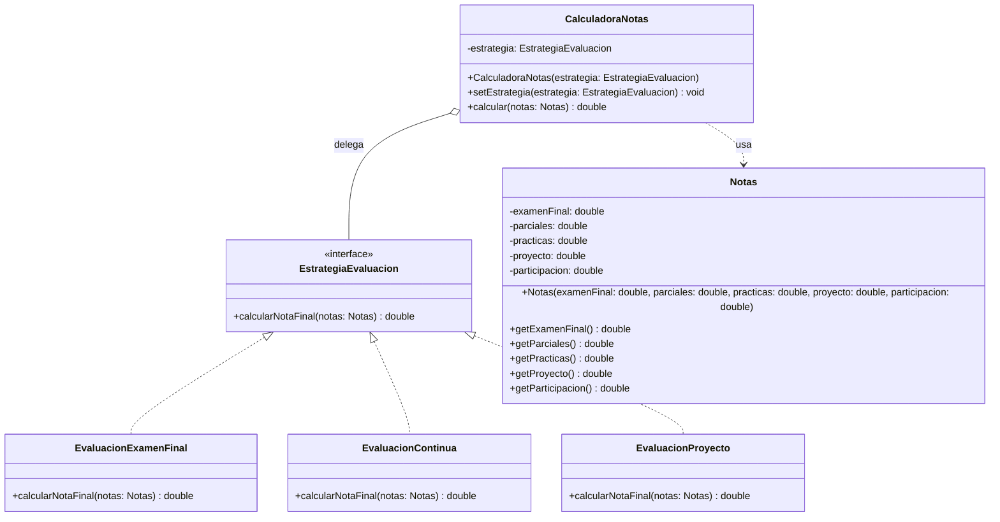

# Ejercicio guiado: Strategy 🧠

> Patrón de comportamiento (POO). En este ejercicio vas a aplicar **Strategy** para encapsular y poder intercambiar distintos algoritmos de cálculo **sin llenar el código de `if/else`**.

## Enunciado / Introducción 🧩

En la universidad, distintas asignaturas calculan la **nota final** de formas diferentes:

- Algunas se basan casi por completo en un **examen final**.
- Otras usan **evaluación continua** (prácticas + parciales + examen).
- Otras dan un peso fuerte al **proyecto**.

En una primera versión “rápida”, alguien implementó el cálculo con un `switch` gigante según el tipo de evaluación. El problema es que cada curso aparecen nuevas variantes y el código acaba siendo:

- difícil de mantener 😵
- difícil de extender
- propenso a errores

Tu objetivo es diseñar un sistema donde el cálculo de la nota sea **intercambiable en tiempo de ejecución**, usando **Strategy**.

Este ejercicio está inspirado en:
- Las transparencias: `./Transpas/8-Strategy.md` (misma estructura, distinta temática)
- El ejemplo de referencia: `./code/es/uva/poo/strategy/` (mismo patrón, otro caso)

---

## Qué vas a construir 🧱

Una mini-aplicación con:

1. **Contexto**: `CalculadoraNotas` (delegará el cálculo)
2. **Strategy**: `EstrategiaEvaluacion` (interfaz del algoritmo)
3. **Estrategias concretas**:
   - `EvaluacionExamenFinal`
   - `EvaluacionContinua`
   - `EvaluacionProyecto`
4. **Datos de entrada**: `Notas` (un objeto simple con las calificaciones parciales)
5. **Cliente**: `Demo` (main de pruebas)

---

## Código cliente (Demo) 🧪

> Este `main` debe compilar y funcionar cuando completes el ejercicio.

```java
package es.uva.poo.strategy;

public class Demo {

    public static void main(String[] args) {
        Notas notas = new Notas(
            7.0,  // examenFinal
            6.5,  // parciales
            8.0,  // practicas
            9.0,  // proyecto
            1.0   // participacion (0..1)
        );

        System.out.println("=== Strategy: cálculo de nota final ===");

        CalculadoraNotas calculadora = new CalculadoraNotas(new EvaluacionExamenFinal());
        System.out.println("Examen final  : " + calculadora.calcular(notas));

        calculadora.setEstrategia(new EvaluacionContinua());
        System.out.println("Continua      : " + calculadora.calcular(notas));

        calculadora.setEstrategia(new EvaluacionProyecto());
        System.out.println("Proyecto      : " + calculadora.calcular(notas));
    }
}
```

Salida orientativa (puede variar):

```text
=== Strategy: cálculo de nota final ===
Examen final  : 7.0
Continua      : 7.45
Proyecto      : 8.15
```

---

## Diagrama de clases (Mermaid) 🗺️



---

## Pasos para la implementación (guiados) 🧭

> Recomendación: usa el paquete `es.uva.poo.strategy` (igual que el ejemplo de código de la asignatura).

### 1) Crea la clase de datos `Notas` 🗂️

Crea una clase inmutable o “casi inmutable” (al menos con getters) con estos campos:

- `double examenFinal`
- `double parciales`
- `double practicas`
- `double proyecto`
- `double participacion` (valor entre 0 y 1)

Plantilla mínima:

```java
public class Notas {

    private final double examenFinal;
    private final double parciales;
    private final double practicas;
    private final double proyecto;
    private final double participacion;

    public Notas(double examenFinal, double parciales, double practicas, double proyecto, double participacion) {
        // TODO: asigna campos
    }

    public double getExamenFinal() { /* TODO */ return 0; }
    public double getParciales() { /* TODO */ return 0; }
    public double getPracticas() { /* TODO */ return 0; }
    public double getProyecto() { /* TODO */ return 0; }
    public double getParticipacion() { /* TODO */ return 0; }
}
```

### 2) Define la interfaz `EstrategiaEvaluacion` 🎯

Debe representar “una forma de calcular” la nota final.

- Método: `double calcularNotaFinal(Notas notas);`

Plantilla:

```java
public interface EstrategiaEvaluacion {
    double calcularNotaFinal(Notas notas);
}
```

### 3) Implementa el contexto `CalculadoraNotas` 🧠

El contexto:

- Guarda una referencia a `EstrategiaEvaluacion`.
- Permite cambiarla en runtime con `setEstrategia(...)`.
- Tiene un método `calcular(Notas)` que **delegue** en la estrategia.

Plantilla sugerida:

```java
public class CalculadoraNotas {

    private EstrategiaEvaluacion estrategia;

    public CalculadoraNotas(EstrategiaEvaluacion estrategia) {
        // TODO: asigna estrategia
    }

    public void setEstrategia(EstrategiaEvaluacion estrategia) {
        // TODO: permite cambiar estrategia
    }

    public double calcular(Notas notas) {
        // TODO: valida que hay estrategia
        // TODO: delega: return estrategia.calcularNotaFinal(notas);
        return 0;
    }
}
```

### 4) Crea las estrategias concretas 🧰

Implementa estas tres clases (todas implementan `EstrategiaEvaluacion`):

#### a) `EvaluacionExamenFinal`

- Nota final = `1.0 * examenFinal`

#### b) `EvaluacionContinua`

- Nota final = `0.50 * examenFinal + 0.20 * parciales + 0.30 * practicas`

#### c) `EvaluacionProyecto`

- Nota final = `0.35 * examenFinal + 0.15 * parciales + 0.20 * practicas + 0.30 * proyecto`
- Si `participacion >= 0.8`, suma un bonus de `+0.5` (sin pasar de 10)

Pista: cada estrategia debería tener **cero `if/else` sobre el tipo de evaluación**. La variación está en la clase concreta.

### 5) Ejecuta el cliente `Demo` ✅

Copia el `Demo` de arriba y verifica que:

- Se calcula la nota con una estrategia.
- Cambias de estrategia con `setEstrategia(...)`.
- El contexto no cambia, solo cambia el “cómo” (algoritmo).

---

## Extensión opcional (sube nota) 🌟

Añade una estrategia nueva, por ejemplo:

- `EvaluacionRecuperacion`: si `examenFinal < 5` entonces la nota final es `min(examenFinal, 4.9)`, en caso contrario usa la fórmula de `EvaluacionContinua`.

Objetivo: añadir una nueva variante **sin tocar** `CalculadoraNotas`.

---

<details>
  <summary>Necesitas ayuda con el código (solución completa) 🛟</summary>
<br>

#### Notas.java

```java
package es.uva.poo.strategy;

public class Notas {

    private final double examenFinal;
    private final double parciales;
    private final double practicas;
    private final double proyecto;
    private final double participacion;

    public Notas(double examenFinal, double parciales, double practicas, double proyecto, double participacion) {
        this.examenFinal = examenFinal;
        this.parciales = parciales;
        this.practicas = practicas;
        this.proyecto = proyecto;
        this.participacion = participacion;
    }

    public double getExamenFinal() {
        return examenFinal;
    }

    public double getParciales() {
        return parciales;
    }

    public double getPracticas() {
        return practicas;
    }

    public double getProyecto() {
        return proyecto;
    }

    public double getParticipacion() {
        return participacion;
    }
}
```

#### EstrategiaEvaluacion.java

```java
package es.uva.poo.strategy;

public interface EstrategiaEvaluacion {
    double calcularNotaFinal(Notas notas);
}
```

#### CalculadoraNotas.java

```java
package es.uva.poo.strategy;

public class CalculadoraNotas {

    private EstrategiaEvaluacion estrategia;

    public CalculadoraNotas(EstrategiaEvaluacion estrategia) {
        this.estrategia = estrategia;
    }

    public void setEstrategia(EstrategiaEvaluacion estrategia) {
        this.estrategia = estrategia;
    }

    public double calcular(Notas notas) {
        if (estrategia == null) {
            throw new IllegalStateException("No hay estrategia configurada en la CalculadoraNotas.");
        }
        return estrategia.calcularNotaFinal(notas);
    }
}
```

#### EvaluacionExamenFinal.java

```java
package es.uva.poo.strategy;

public class EvaluacionExamenFinal implements EstrategiaEvaluacion {

    @Override
    public double calcularNotaFinal(Notas notas) {
        return notas.getExamenFinal();
    }
}
```

#### EvaluacionContinua.java

```java
package es.uva.poo.strategy;

public class EvaluacionContinua implements EstrategiaEvaluacion {

    @Override
    public double calcularNotaFinal(Notas notas) {
        return 0.50 * notas.getExamenFinal()
             + 0.20 * notas.getParciales()
             + 0.30 * notas.getPracticas();
    }
}
```

#### EvaluacionProyecto.java

```java
package es.uva.poo.strategy;

public class EvaluacionProyecto implements EstrategiaEvaluacion {

    @Override
    public double calcularNotaFinal(Notas notas) {
        double nota = 0.35 * notas.getExamenFinal()
                    + 0.15 * notas.getParciales()
                    + 0.20 * notas.getPracticas()
                    + 0.30 * notas.getProyecto();

        if (notas.getParticipacion() >= 0.8) {
            nota += 0.5;
        }

        return Math.min(nota, 10.0);
    }
}
```

</details>
<br>
