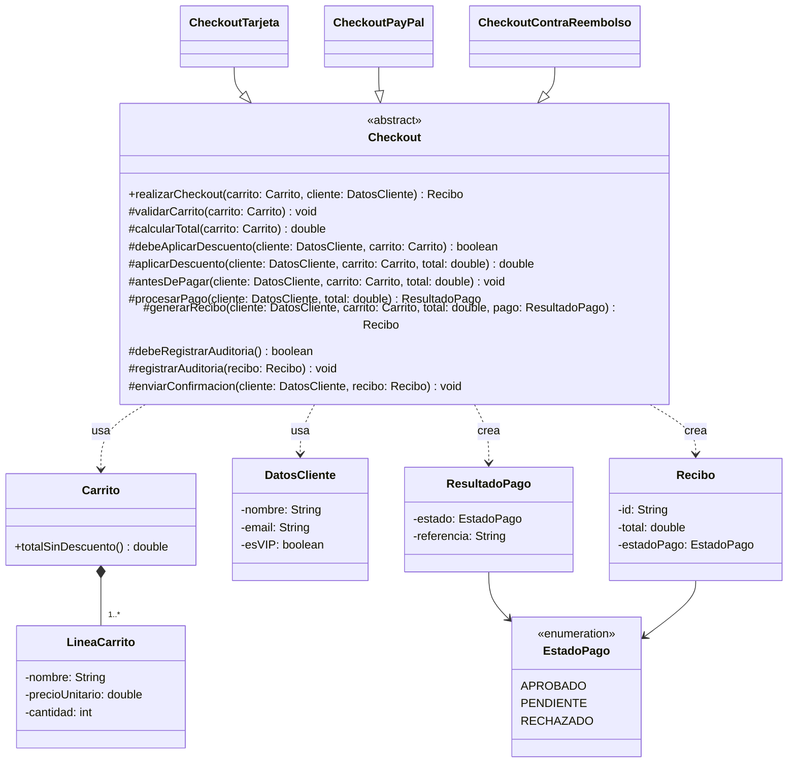

# Ejercicio guiado — Template Method (Método plantilla) 🧩

En este ejercicio vas a aplicar el patrón **Template Method** para modelar un proceso con un **flujo fijo** (siempre ocurre en el mismo orden) pero con **algunos pasos variables** según el caso.

> Idea clave: la clase base define el **esqueleto** del algoritmo en un método plantilla (normalmente `final`) y delega a las subclases la implementación de pasos concretos. Opcionalmente, ofrece **hooks** (ganchos) para personalización.

---

## Enunciado: “Checkout” de una tienda online 🛒

Estás implementando el “checkout” (finalización de compra) de una tienda online. Independientemente del método de pago, el flujo general es siempre el mismo:

1. Validar el carrito.
2. Calcular el total.
3. (Opcional) Aplicar un descuento.
4. Procesar el pago.
5. Generar un recibo.
6. (Opcional) Registrar la compra en un log / auditoría.
7. Enviar confirmación al cliente.

Sin embargo, **el paso de pago** cambia según el método elegido:

- Tarjeta (simular validación y cargo)
- PayPal (simular redirección/autorización)
- Contra reembolso (no se cobra ahora, se marca como pendiente)

Tu objetivo es evitar duplicación: **no** quieres tres clases con el mismo flujo “copiado y pegado” con pequeñas variaciones.

---

## Objetivos de aprendizaje ✅

- Identificar qué parte del algoritmo es común y cuál varía.
- Implementar un método plantilla `final` con el flujo general.
- Definir **operaciones primitivas** (pasos `abstract`) para lo variable.
- Añadir **hooks** para permitir extensiones opcionales sin romper el flujo.

---

## Diseño propuesto (orientativo)

Crea un paquete (por ejemplo) `es.uva.poo.ejercicios.templatemethod.checkout` y define:

- `Checkout` (clase abstracta)
  - Contiene el método plantilla `final realizarCheckout(...)`.
  - Declara pasos abstractos para lo variable (p.ej. `procesarPago(...)`).
  - Incluye hooks (p.ej. `debeAplicarDescuento()`, `debeRegistrarAuditoria()`, `antesDePagar(...)`).

- `CheckoutTarjeta`, `CheckoutPayPal`, `CheckoutContraReembolso` (subclases)
  - Implementan los pasos variables.
  - (Opcional) sobrescriben hooks.

- Modelos mínimos
  - `Carrito` + `LineaCarrito` (o similar), lo justo para calcular un total.

### Diagrama de clases (Mermaid)

Este diagrama resume la estructura que se pretende implementar: una clase abstracta con el **método plantilla** y tres subclases que solo cambian el paso de pago (y, opcionalmente, algunos hooks).



---

## Pasos para la implementación 🛠️

### 1) Modelos mínimos del carrito

Crea clases simples para poder hacer pruebas:

- `LineaCarrito` con:
  - `String nombre`
  - `double precioUnitario`
  - `int cantidad`

- `Carrito` con:
  - `List<LineaCarrito> lineas`
  - método `double totalSinDescuento()`

> Consejo: no te compliques con IVA, envíos, etc. Lo importante es el patrón.

---

### 2) Clase abstracta `Checkout` (la plantilla)

Implementa el método plantilla `realizarCheckout(...)` con el flujo fijo.

- Debe ser `public final` para que nadie cambie el orden del algoritmo.
- Se apoya en:
  - pasos con implementación por defecto (comunes)
  - pasos `abstract` (variables)
  - hooks opcionales

Esqueleto sugerido (deja los TODO para completar):

```java
public abstract class Checkout {

    public final Recibo realizarCheckout(Carrito carrito, DatosCliente cliente) {
        validarCarrito(carrito);

        double total = calcularTotal(carrito);

        if (debeAplicarDescuento(cliente, carrito)) {
            total = aplicarDescuento(cliente, carrito, total);
        }

        antesDePagar(cliente, carrito, total); // hook

        ResultadoPago pago = procesarPago(cliente, total); // PASO ABSTRACTO

        Recibo recibo = generarRecibo(cliente, carrito, total, pago);

        if (debeRegistrarAuditoria()) {
            registrarAuditoria(recibo);
        }

        enviarConfirmacion(cliente, recibo);
        return recibo;
    }

    // Comunes (puedes dar implementación por defecto)
    protected void validarCarrito(Carrito carrito) {
        // TODO: comprobar que hay al menos una línea y cantidades > 0
    }

    protected double calcularTotal(Carrito carrito) {
        // TODO: sumar precioUnitario * cantidad
        return 0.0;
    }

    // Hook booleano: por defecto no hay descuento
    protected boolean debeAplicarDescuento(DatosCliente cliente, Carrito carrito) {
        return false;
    }

    protected double aplicarDescuento(DatosCliente cliente, Carrito carrito, double total) {
        // TODO: aplica un descuento (p.ej. 10%) y devuelve el nuevo total
        return total;
    }

    // Hook vacío
    protected void antesDePagar(DatosCliente cliente, Carrito carrito, double total) {
        // Por defecto no hace nada
    }

    // Paso variable obligatorio
    protected abstract ResultadoPago procesarPago(DatosCliente cliente, double total);

    protected Recibo generarRecibo(DatosCliente cliente, Carrito carrito, double total, ResultadoPago pago) {
        // TODO: crear y devolver un recibo
        return null;
    }

    // Hook booleano: por defecto sí registramos
    protected boolean debeRegistrarAuditoria() {
        return true;
    }

    protected void registrarAuditoria(Recibo recibo) {
        // TODO: imprimir por consola o guardar en una lista
    }

    protected void enviarConfirmacion(DatosCliente cliente, Recibo recibo) {
        // TODO: simular email/sms con System.out.println
    }
}
```

> Fíjate: el cliente (el `main`) solo llamará a `realizarCheckout(...)` sin saber cómo se paga internamente.

---

### 3) Subclases: implementa el pago (lo variable)

Crea las clases concretas:

- `CheckoutTarjeta`
  - `procesarPago(...)` simula validación y devuelve “APROBADO”.

- `CheckoutPayPal`
  - `procesarPago(...)` simula autorización y devuelve “APROBADO”.
  - (Opcional) sobrescribe `antesDePagar(...)` para mostrar un mensaje extra.

- `CheckoutContraReembolso`
  - `procesarPago(...)` devuelve “PENDIENTE”.
  - (Opcional) sobrescribe `debeRegistrarAuditoria()` para que sea `false`.

No hace falta que uses APIs reales de pago; vale con clases `ResultadoPago` y `Recibo` simples.

---

### 4) Verificación: ejecuta el cliente (main) 🔍

Comprueba que:

- El orden del flujo es el mismo para todos.
- Solo cambia el comportamiento del pago (y hooks que tú decidas).
- No has duplicado el flujo del checkout en tres sitios.

---

## Código cliente (Main) 👇

Este `main` es el **código cliente** de prueba. Debe funcionar cuando completes las clases.

```java
public class Main {

    public static void main(String[] args) {
        Carrito carrito = new Carrito();
        carrito.addLinea(new LineaCarrito("Camiseta", 12.95, 2));
        carrito.addLinea(new LineaCarrito("Taza", 6.50, 1));

        DatosCliente cliente = new DatosCliente("Ana", "ana@correo.es", true);

        Checkout checkout1 = new CheckoutTarjeta();
        Checkout checkout2 = new CheckoutPayPal();
        Checkout checkout3 = new CheckoutContraReembolso();

        System.out.println("=== TARJETA ===");
        checkout1.realizarCheckout(carrito, cliente);

        System.out.println("\n=== PAYPAL ===");
        checkout2.realizarCheckout(carrito, cliente);

        System.out.println("\n=== CONTRA REEMBOLSO ===");
        checkout3.realizarCheckout(carrito, cliente);
    }
}
```

---

## Pistas y requisitos mínimos 🧠

- `DatosCliente` puede tener:
  - `String nombre`
  - `String email`
  - `boolean esVIP` (para activar descuento con un hook)

- `ResultadoPago` puede tener:
  - `EstadoPago estado` (`APROBADO`, `PENDIENTE`, `RECHAZADO`)
  - `String referencia`

- `Recibo` puede tener:
  - `String id`
  - `double total`
  - `EstadoPago estadoPago`

---

<details>
  <summary>Necesitas ayuda con el código.</summary>
<br>

#### Solución completa (orientativa)

> Omito imports para no hacerlo tan largo.

```java
// Paquete sugerido: es.uva.poo.ejercicios.templatemethod.checkout

enum EstadoPago { APROBADO, PENDIENTE, RECHAZADO }

class DatosCliente {
    private final String nombre;
    private final String email;
    private final boolean vip;

    public DatosCliente(String nombre, String email, boolean vip) {
        this.nombre = nombre;
        this.email = email;
        this.vip = vip;
    }

    public String getNombre() { return nombre; }
    public String getEmail() { return email; }
    public boolean isVip() { return vip; }
}

class LineaCarrito {
    private final String nombre;
    private final double precioUnitario;
    private final int cantidad;

    public LineaCarrito(String nombre, double precioUnitario, int cantidad) {
        this.nombre = nombre;
        this.precioUnitario = precioUnitario;
        this.cantidad = cantidad;
    }

    public String getNombre() { return nombre; }
    public double getPrecioUnitario() { return precioUnitario; }
    public int getCantidad() { return cantidad; }
}

class Carrito {
    private final java.util.List<LineaCarrito> lineas = new java.util.ArrayList<>();

    public void addLinea(LineaCarrito linea) {
        lineas.add(linea);
    }

    public java.util.List<LineaCarrito> getLineas() {
        return java.util.Collections.unmodifiableList(lineas);
    }
}

class ResultadoPago {
    private final EstadoPago estado;
    private final String referencia;

    public ResultadoPago(EstadoPago estado, String referencia) {
        this.estado = estado;
        this.referencia = referencia;
    }

    public EstadoPago getEstado() { return estado; }
    public String getReferencia() { return referencia; }
}

class Recibo {
    private final String id;
    private final String cliente;
    private final double total;
    private final EstadoPago estadoPago;
    private final String referenciaPago;

    public Recibo(String id, String cliente, double total, EstadoPago estadoPago, String referenciaPago) {
        this.id = id;
        this.cliente = cliente;
        this.total = total;
        this.estadoPago = estadoPago;
        this.referenciaPago = referenciaPago;
    }

    public String getId() { return id; }
    public double getTotal() { return total; }
    public EstadoPago getEstadoPago() { return estadoPago; }
    public String getReferenciaPago() { return referenciaPago; }

    @Override
    public String toString() {
        return "Recibo{" +
                "id='" + id + '\'' +
                ", cliente='" + cliente + '\'' +
                ", total=" + total +
                ", estadoPago=" + estadoPago +
                ", referenciaPago='" + referenciaPago + '\'' +
                '}';
    }
}

abstract class Checkout {

    public final Recibo realizarCheckout(Carrito carrito, DatosCliente cliente) {
        validarCarrito(carrito);

        double total = calcularTotal(carrito);

        if (debeAplicarDescuento(cliente, carrito)) {
            total = aplicarDescuento(cliente, carrito, total);
        }

        antesDePagar(cliente, carrito, total);

        ResultadoPago pago = procesarPago(cliente, total);

        Recibo recibo = generarRecibo(cliente, carrito, total, pago);

        if (debeRegistrarAuditoria()) {
            registrarAuditoria(recibo);
        }

        enviarConfirmacion(cliente, recibo);
        return recibo;
    }

    protected void validarCarrito(Carrito carrito) {
        if (carrito == null || carrito.getLineas().isEmpty()) {
            throw new IllegalArgumentException("El carrito está vacío");
        }
        for (LineaCarrito l : carrito.getLineas()) {
            if (l.getCantidad() <= 0) {
                throw new IllegalArgumentException("Cantidad inválida para: " + l.getNombre());
            }
            if (l.getPrecioUnitario() < 0) {
                throw new IllegalArgumentException("Precio inválido para: " + l.getNombre());
            }
        }
    }

    protected double calcularTotal(Carrito carrito) {
        double total = 0.0;
        for (LineaCarrito l : carrito.getLineas()) {
            total += l.getPrecioUnitario() * l.getCantidad();
        }
        return total;
    }

    protected boolean debeAplicarDescuento(DatosCliente cliente, Carrito carrito) {
        return cliente != null && cliente.isVip();
    }

    protected double aplicarDescuento(DatosCliente cliente, Carrito carrito, double total) {
        double descuento = 0.10; // 10%
        double nuevoTotal = total * (1.0 - descuento);
        System.out.println("Aplicando descuento VIP (10%): " + total + " -> " + nuevoTotal);
        return nuevoTotal;
    }

    protected void antesDePagar(DatosCliente cliente, Carrito carrito, double total) {
        // hook
    }

    protected abstract ResultadoPago procesarPago(DatosCliente cliente, double total);

    protected Recibo generarRecibo(DatosCliente cliente, Carrito carrito, double total, ResultadoPago pago) {
        String id = "R-" + System.currentTimeMillis();
        String nombre = (cliente == null ? "(sin-nombre)" : cliente.getNombre());
        return new Recibo(id, nombre, total, pago.getEstado(), pago.getReferencia());
    }

    protected boolean debeRegistrarAuditoria() {
        return true;
    }

    protected void registrarAuditoria(Recibo recibo) {
        System.out.println("[AUDITORIA] " + recibo);
    }

    protected void enviarConfirmacion(DatosCliente cliente, Recibo recibo) {
        String destino = (cliente == null ? "(sin-email)" : cliente.getEmail());
        System.out.println("Enviando confirmación a " + destino + ": " + recibo.getId());
    }
}

class CheckoutTarjeta extends Checkout {
    @Override
    protected ResultadoPago procesarPago(DatosCliente cliente, double total) {
        System.out.println("Procesando pago con TARJETA por " + total);
        return new ResultadoPago(EstadoPago.APROBADO, "CARD-" + (int)(Math.random() * 100000));
    }
}

class CheckoutPayPal extends Checkout {
    @Override
    protected void antesDePagar(DatosCliente cliente, Carrito carrito, double total) {
        System.out.println("Redirigiendo a PayPal para autorizar...");
    }

    @Override
    protected ResultadoPago procesarPago(DatosCliente cliente, double total) {
        System.out.println("Pago PayPal autorizado por " + total);
        return new ResultadoPago(EstadoPago.APROBADO, "PP-" + (int)(Math.random() * 100000));
    }
}

class CheckoutContraReembolso extends Checkout {
    @Override
    protected ResultadoPago procesarPago(DatosCliente cliente, double total) {
        System.out.println("Contra reembolso: el cobro queda PENDIENTE (" + total + ")");
        return new ResultadoPago(EstadoPago.PENDIENTE, "COD-" + (int)(Math.random() * 100000));
    }

    @Override
    protected boolean debeRegistrarAuditoria() {
        return false;
    }
}

public class Main {

    public static void main(String[] args) {
        Carrito carrito = new Carrito();
        carrito.addLinea(new LineaCarrito("Camiseta", 12.95, 2));
        carrito.addLinea(new LineaCarrito("Taza", 6.50, 1));

        DatosCliente cliente = new DatosCliente("Ana", "ana@correo.es", true);

        Checkout checkout1 = new CheckoutTarjeta();
        Checkout checkout2 = new CheckoutPayPal();
        Checkout checkout3 = new CheckoutContraReembolso();

        System.out.println("=== TARJETA ===");
        checkout1.realizarCheckout(carrito, cliente);

        System.out.println("\n=== PAYPAL ===");
        checkout2.realizarCheckout(carrito, cliente);

        System.out.println("\n=== CONTRA REEMBOLSO ===");
        checkout3.realizarCheckout(carrito, cliente);
    }
}
```

</details>
<br>
